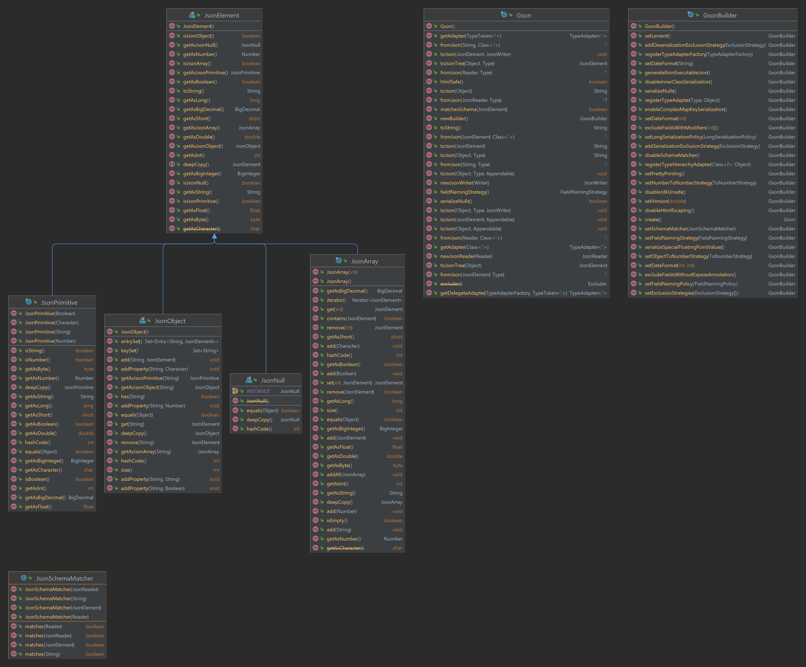

# Report for assignment 4

This is a template for your report. You are free to modify it as needed.
It is not required to use markdown for your report either, but the report
has to be delivered in a standard, cross-platform format.

## Project

Name: google/gson

URL: https://github.com/google/gson

The [`google/gson`](https://github.com/google/gson) repository is a Java library for serializing and deserializing JSON.

## Onboarding experience

We decided to stick with the [`google/gson`](https://github.com/google/gson) project.

The project clearly shows how to add is as a dependency to one of your own projects with both maven and gradle.

For contributing though, the documentation is very poor. How to configure the project and run hte test suite is not documented. This isn't that bad though, since it's a maven project it's fairly standardized how to build and execute anyways.

There is no issue template, or other standard documentation such as code of conduct.

They have a [design documented linked in the README](https://github.com/google/gson/blob/master/GsonDesignDocument.md) which is rather helpful in understanding why it's built like it is.

Even though the lifecycle methods were exposed and properly caught by IntelliJ (the editor all group members use). We all had difficulties getting it to run properly as a custom _run configuration_ (which meant we didn't get proper stack traces on errors in the test suite, etc). Only after manually editing the `pom.xml` to use a higher java version, could we run it from inside IntelliJ. All of this could probably be better documented to help starters in the project.

## Effort spent

|                                       | Ludwig Kristoffersson | Arvid Siberov | Katrina Liang | Marcus Alevärn | Samuel Philipson |
|---------------------------------------|-----------------------|---------------|---------------|----------------|------------------|
| Plenary discussions/meetings          | 3                     | 3             | 3             | 3              | 3                |
| Discussions within parts of the group | 1                     | 0             | 0             | 0              | 0                |
| Reading documentation                 | 1                     | 1             | 1             | 1              | 1                |
| Configuration and setup               | 2                     | 0             | 0             | 0              | 0                |
| Analyzing code/output                 | 0                     | 0             | 0             | 0              | 0                |
| Writing documentation                 | 2                     | 1.5           | 0             | 3.5            | 0                |
| Writing code                          | 10                    | 11.5          | 0             | 13.5           | 0                |
| Running code                          | 1                     | 0             | 0             | 0              | 0                |
| **Total**                             | 0                     | 0             | 0             | 0              | 0                |

## Overview of issue(s) and work done.

Title: Validate JSon again Json Schema file #783

URL: https://github.com/google/gson/issues/783

We picked issue [#783](https://github.com/google/gson/issues/783) which was about adding an implementation of JSON schema.
JSON Schema is a standard for checking if a JSON document has a specific structure. With JSON schema we can enforce types
and, for example, ensure that an object has a set of required properties.

> Scope (functionality and code affected)

The JSON schema feature could be implemented in isolation from the rest of the codebase.
It was like an extension.
However, to make it easier for the user to use our JSON schema extension, we needed to integrate the JSON schema code into the existing `Gson` class.
This turned out to be much more difficult than we anticipated. The `Gson` class used a completely different approach (with TypeAdapters) to parse the JSON document. We used the `JsonParser` class in our `JsonSchemaMather` class for parsing. These two approaches were not compatible with each other and hence we could not integrate our code into the `Gson` class without failing certain tests. Google provides both the TypeAdapters and the `JsonParser` classes, and it is very unpleasant that they are not consistent in how to handle different edge cases. For example, if there are two duplicate keys in a JSON object, then TypeAdapters throws an exception, while `JsonParser` overwrites the value of the key. Because of this, we chose to redesign this feature. Instead of matching while parsing the JSON, we instead only allow for matching already parsed JSON through the `Gson.matchesSchema` method.

## Requirements for the new feature or requirements affected by functionality being refactored

> ~~Optional (point 3): trace tests to requirements.~~

The requirements for the feature was specified on a very high level in the
[initial suggestion](https://github.com/google/gson/issues/783#issue-131196793).
To validate JSON against a JSON schema file was the main requirement, and some
suggestions regarding the design of the API and the implementation was made as
well. These were not seen as hard requirements by us - rather, we decided to
only see validation of JSON, in whatever way, as the only hard requirement
stated in this issue.

We could not base these requirements on code reviews or existing test cases,
since this issue is an enhancement, adding completely new functionality to the
project. We had to instead research the requirements based on external sources.

Validation of JSON is quite a complex task.
[https://json-schema.org](https://json-schema.org) has formal specifications of
JSON schemas, as well as more beginner friendly guides. When reading the
[Getting Started Step-By-Step](https://json-schema.org/learn/getting-started-step-by-step)
guide and looking through the
[2020-12 draft of the JSON Schema Core specification](https://json-schema.org/draft/2020-12/json-schema-core.html)
and also the [2020-12 draft of the JSON Schema Validation specification](https://json-schema.org/draft/2020-12/json-schema-validation.html) we soon realized that a complete implementation of the entire specification
would be outside the scope of this assignment. We decided to specify a
subset of the features defined in the specification, and implement this
as a starting point, leaving room for a complete implementation if time allows.
These requirements are as follows:

| Id | Title                                       | Description                                                                                                                                                                                             | Issue                                                                     |
|----|---------------------------------------------|---------------------------------------------------------------------------------------------------------------------------------------------------------------------------------------------------------|---------------------------------------------------------------------------|
| 1  | Match a JSON schema against a JSON instance | We want a class `JsonSchemaMatcher` that takes a JSON schema as input and has a function `matches` that can match the JSON schema against a JSON instance.                                              | [Issue #2](https://github.com/Fundamentals-KTH-CSC-2022-P3/gson/issues/2) |
| 2  | Validate a JSON schema                      | We want a class `JsonSchemaValidator` that takes a JSON schema as input and has a function `validate` that ensures that the schema is valid (according to the subset of the specification that we use). | [Issue #1](https://github.com/Fundamentals-KTH-CSC-2022-P3/gson/issues/1) |
| 3  | Support the `type` property                 | When matching a JSON schema against a JSON instance we would like to support the `type` property which can enforce a specific type that the instance must use.                                          | [Issue #2](https://github.com/Fundamentals-KTH-CSC-2022-P3/gson/issues/2) |
| 4  | Support the `properties` property           | When matching a JSON schema against a JSON instance object we would like to support the `properties` property which defines the structure of the members of the JSON instance object.                   | [Issue #2](https://github.com/Fundamentals-KTH-CSC-2022-P3/gson/issues/2) |
| 5  | Support the `required` property             | When matching a JSON schema against a JSON instance object we would like to support the `required` property which defines the members that are required to exist in the JSON instance object.           | [Issue #2](https://github.com/Fundamentals-KTH-CSC-2022-P3/gson/issues/2) |
| 6  | Support the `items` property                | When matching a JSON schema against a JSON instance array we would like to support the `items` property which defines the structure that all elements in the JSON instance array must obey.             | [Issue #2](https://github.com/Fundamentals-KTH-CSC-2022-P3/gson/issues/2) |
| 7  | Support the `minItems` property             | When matching a JSON schema against a JSON instance array we would like to support the `minItems` property which defines the minimum number of elements that must exist inside the JSON instance array. | [Issue #2](https://github.com/Fundamentals-KTH-CSC-2022-P3/gson/issues/2) |
| 8  | Support the `uniqueItems` property          | When matching a JSON schema against a JSON instance array we would like to support the `uniqueItems` property which ensures that all elements in the JSON instance array are unique.                    | [Issue #2](https://github.com/Fundamentals-KTH-CSC-2022-P3/gson/issues/2) |
| 9  | Support the `minimum` property              | When matching a JSON schema against a JSON instance number we would like to support the `minimum` property which ensures that the JSON instance number is greater than or equal to a specific value.    | [Issue #2](https://github.com/Fundamentals-KTH-CSC-2022-P3/gson/issues/2) |
| 10 | Support the `maximum` property              | When matching a JSON schema against a JSON instance number we would like to support the `maximum` property which ensures that the JSON instance number is less than or equal to a specific value.       | [Issue #2](https://github.com/Fundamentals-KTH-CSC-2022-P3/gson/issues/2) |
| 11 | Support the `exclusiveMinimum` property     | When matching a JSON schema against a JSON instance number we would like to support the `exclusiveMinimum` property which ensures that the JSON instance number is greater than a specific value.       | [Issue #2](https://github.com/Fundamentals-KTH-CSC-2022-P3/gson/issues/2) |
| 12 | Support the `exclusiveMaximum` property     | When matching a JSON schema against a JSON instance number we would like to support the `exclusiveMaximum` property which ensures that the JSON instance number is less than a specific value.          | [Issue #2](https://github.com/Fundamentals-KTH-CSC-2022-P3/gson/issues/2) |

In turned out that we could implement these requirements quite fast, and hence we extended our subset of the specification a bit and added some more properties from the specification. These extended requirements are as follows:

| Id | Title                                                         | Description                                                                                                                                                                 | Issue                                                                       |
|----|---------------------------------------------------------------|-----------------------------------------------------------------------------------------------------------------------------------------------------------------------------|-----------------------------------------------------------------------------|
| 13 | Support the `enum` property                                   | When matching a JSON schema against a JSON instance we would like to support the `enum` property which defines a set of values that the instance must pick from.            | [Issue #11](https://github.com/Fundamentals-KTH-CSC-2022-P3/gson/issues/11) |
| 14 | Integrate the `JsonSchemaMatcher` class into the `Gson` class | We would like to have a user-friendly way to use our `JsonSchemaMatcher` code. Modify the `Gson` class such that it is easy to match a JSON schema against a JSON instance. | [Issue #5](https://github.com/Fundamentals-KTH-CSC-2022-P3/gson/issues/5)   |

## Code changes

### Patch

(copy your changes or the add git command to show them)

git diff ...

Optional (point 4): the patch is clean.

Optional (point 5): considered for acceptance (passes all automated checks).

## Test results

> Overall results with link to a copy or excerpt of the logs (before/after
refactoring).

The output of running the tests before any work was done can be seen
[here](log/81bb6d1dec28ca135382e29e3eccffcc957726be/).
The [output.txt](log/81bb6d1dec28ca135382e29e3eccffcc957726be/output.txt)
file contains the console output from running `maven test`, and the
[surefire](log/81bb6d1dec28ca135382e29e3eccffcc957726be/surefire/) folder
contains the generated Surefire report.

## UML class diagram and its description

Since our issue was to add a new feature, and this feature was quite orthogonal
to the rest of gson's functionality, the changes we had to introduce could be
kept very local. In the end we only had to add one new class that did not
inherit from other classes or implement interfaces already present in the
project. It does, however, make use of several existing classes and their
functionalities. These are included for clarity in the diagram.

The class diagram for the new class JsonSchemaMatcher, as well as the most
significant classes already present in the project for this issue is included
below:

### Key changes/classes affected

> ~~Optional (point 1): Architectural overview.~~

> ~~Optional (point 2): relation to design pattern(s).~~

## Overall experience

> What are your main take-aways from this project? What did you learn?

The primary take-away from this project is the challenges regarding integration
of new features into an existing code base. The application logic for the
requested feature that we implemented was not too challenging. Implementing
the entire JSON schema standard would be time consuming, but we have already
implemented a significant part of it, and implementing the rest would be a
lengthy but straightforward process.

The problems with the integration could have been avoided if we spent more
time on researching the structure of the project. We found _one_ way of
parsing JSON that Gson provided, and assumed that using that way would work
out. In fact, Gson has several non compatible ways of parsing JSON, and the
`fromJson` method that we wanted to integrate our functionality with used
an incompatible one from our code. A more detailed plan, created from more
elaborate research, would have allowed us to make a better solution. It is,
however, not easy to know when you have researched "enough". This could have
been helped by a clearer problem statement. As it was, the issue was a
quite parsimonious feature request, and we had to fill in a lot of the blanks
ourselves regarding how the functionality was to be designed.

Furthermore, researching different OSS projects gave us a lot of insicts into
how differently these can be structured. Which issue tracker is used, how
patches are to be submitted, and how elaborate the requirements in the
CONTRIBUTING file varied greatly. Licensing was also something that we realised
was quite a spider's nest. We briefly considered Elasticsearch instead of
Gson, but as of recently Elasticsearch has changed license from the OSI approved
Apache 2.0 license to the Elastic license, which is not approved by the OSI
and therefore not allowed for this assignment.

In the end, our main take-away from this project was the friends we made along
the way.

> How did you grow as a team, using the Essence standard to evaluate yourself?

Our assessment can be found [here](https://docs.google.com/document/d/1XJc1R4Db2PLmgEDtZTL-Bu86uDo7R8cj4A2kuxIYq5k). Or as a PDF in [essence/Issue Resolution - Assessment of Team.pdf](essence/Issue_Resolution_-_Assessment_of_Team.pdf)

> ~~Optional (point 6): How would you put your work in context with best software engineering practice?~~

> ~~Optional (point 7): Is there something special you want to mention here?~~
